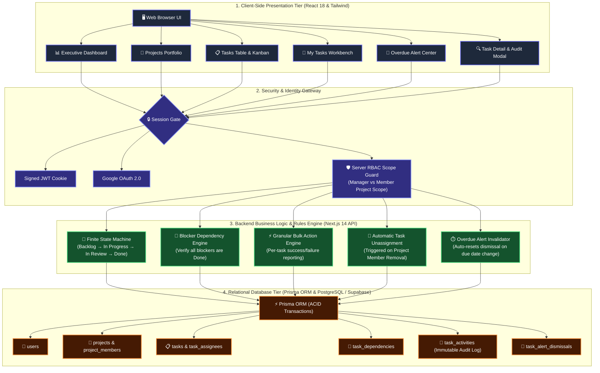
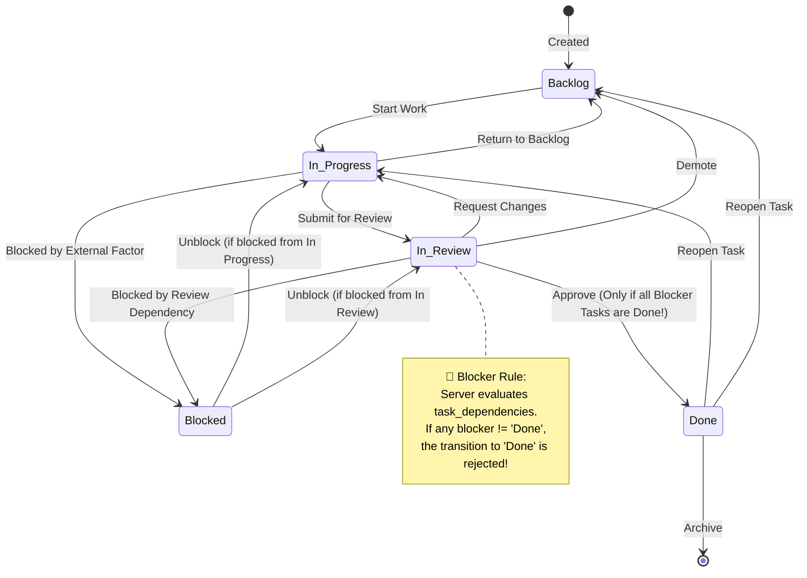

# ⚡ PulseTrack — Enterprise Multi-Client Project & Task Operations System

[](https://nextjs.org/)
[](https://www.typescriptlang.org/)
[](https://tailwindcss.com/)
[](https://www.prisma.io/)
[](https://supabase.com/)
[](https://cloud.google.com/)
[](test/lifecycle.test.ts)

> **Assignment 01 — Project & Task Tracking System**  
> A production-grade web application engineered for professional services companies running multiple simultaneous client engagements. Built with strict server-enforced business rules, a deterministic state machine, blocker dependency enforcement, and immutable audit logging.

---

## 🎯 Executive Overview: The Problem & Solution

In client services companies (software consultancies, agencies, engineering firms), teams juggle a dozen client retainers simultaneously. When task management lives across spreadsheets and chat threads:
- **Deadlines slip quietly** until the client brings it up.
- **Resource imbalance occurs** — some engineers are buried across four projects while others are idle.
- **Task blockers are invisible**, causing cascading project delays.

**PulseTrack** solves this with a unified operational platform:
1. **Executive Visibility**: Live portfolio health, team workload capacity matrix ("who is overloaded"), and an 8-week completion trajectory.
2. **Strict Business Integrity**: A server-validated finite state machine (`Backlog` → `In Progress` → `In Review` → `Done`), blocker dependency checks, and append-only audit histories that cannot be rewritten.
3. **Personal Clarity**: A dedicated **"My Tasks"** workbench aggregating assigned work across all client projects.

---

## 🏗️ System Architecture & Data Flow



---

## 🔄 Task Lifecycle State Machine & Blocker Flow



---

## 🌟 10 Core Engineering Highlights

| Feature | Engineering Implementation |
|---|---|
| 🛡️ **Role-Based Access Control (RBAC)** | Strict server-enforced `manager` vs `member` permission boundary. Members are strictly scoped to their enrolled projects. |
| 🔄 **Deterministic State Machine** | Pure TypeScript lifecycle engine (`lib/state-machine.ts`). Rejects illegal status jumps with descriptive server error messages. |
| 🛑 **Blocker Dependency Engine** | Prevents moving tasks to `Done` if prerequisite blocking tasks within the project are unfinished. |
| 👥 **Multi-Assignee & Auto-Unassign** | Project-scoped assignments. Removing a user from a project team atomically unassigns them from all project tasks and logs an immutable audit event. |
| 🔍 **Server-Side Finder & Pagination** | Fast indexed server-side text search over titles & descriptions, multi-facet filtering (Project, Status, Assignee, Priority, Overdue), and database pagination. |
| ⚡ **Granular Bulk Action Engine** | Multi-select task batch operations (status, assignee, due date) with itemized per-task success/failure reporting (no whole-batch crashes). |
| 📊 **Dashboard & Capacity Analysis** | Real-time KPI summary cards, team capacity matrix with live **"Overloaded"** flags, and 8-week completion velocity bar chart. |
| 📜 **Immutable Audit Timeline** | Append-only `task_activities` journal recording every status move, field change, assignment, and comment with timestamps and author signatures. |
| 🚨 **Self-Invalidating Overdue Alerts** | Overdue alert center with dynamic navbar badge count. User dismissals automatically reset if a manager reschedules the due date. |
| 🌐 **Google OAuth 2.0 & JWT Auth** | Dual authentication supporting Google Cloud OAuth 2.0 (redirect & code exchange) and bcrypt email/password with secure HTTP-only cookies. |

---

## 📂 Project Organization

```
├── 🎨 frontend/                     # Client Presentation
│   ├── components/                 # Dashboard, Projects, Tasks (Table & Kanban), Modals
│   ├── context/                    # AuthContext (Sessions, 1-Click Role Switcher, Alerts)
│   └── styles/                     # Tailwind CSS & Design System
│
├── ⚙️ backend/                      # Server Business Logic
│   ├── api/                        # 15 REST API Route Handlers
│   ├── auth/                       # JWT Sign/Verify, Bcrypt, Google OAuth Service
│   └── services/                   # Pure State Machine Engine & Blocker Validation
│
├── 🗄️ database/                     # Relational Persistence
│   ├── schema.prisma               # Prisma Schema (Models, Indexes & Cascades)
│   ├── seed.ts                     # Multi-Project Realistic Seed Dataset
│   └── client.ts                   # Prisma Singleton Client
│
├── 📚 docs/                         # Assignment Documentation Suite
│   ├── architecture.md             # System Components, Request Paths & Non-Goals
│   ├── schema.md                   # Tables, Constraints & 100x Scaling Analysis
│   ├── plan.md                     # Build Sequencing & Estimate vs Actuals
│   ├── decisions.md                # 5 Architectural Decisions + 1 Reversed Choice
│   └── ai-prompts.md               # Prompt Logs & Corrections
│
├── 🧪 test/                         # Automated Verification
│   └── lifecycle.test.ts           # 14/14 Passing Lifecycle & Blocker Test Suite
│
├── 📄 SUBMISSION.md                # Completed Assignment Submission Brief
└── 📄 README.md                    # Project Documentation
```

---

## 🧰 Tech Stack

- **Framework**: [Next.js 14 (App Router)](https://nextjs.org/)
- **Language**: [TypeScript](https://www.typescriptlang.org/) (Strict Mode)
- **UI & Styling**: [React 18](https://react.dev/), [Tailwind CSS](https://tailwindcss.com/), [Lucide React Icons](https://lucide.dev/)
- **Database & ORM**: [Prisma ORM 5](https://www.prisma.io/) with [PostgreSQL (Supabase)](https://supabase.com/) & SQLite
- **Security & Auth**: [Google OAuth 2.0](https://cloud.google.com/), [Jose](https://github.com/panva/jose) (JWT), [Bcrypt.js](https://github.com/dcodeIO/bcrypt.js)
- **Date Math**: [Date-fns](https://date-fns.org/)
- **Testing**: Node.js Automated Test Harness with [TSX](https://github.com/privatenumber/tsx)

---

## 🚀 Quick Start (Run Locally in 60 Seconds)

### 1. Clone & Install Dependencies
```bash
git clone https://github.com/Ritesh-iiitn/project-task-tracker-.git
cd project-task-tracker-
npm install
```

### 2. Setup Environment Variables
Copy `.env.example` to `.env`:
```bash
cp .env.example .env
```

### 3. Initialize & Seed Database
```bash
# Push schema tables
npx prisma db push

# Seed realistic demo client projects, tasks, blocker chains & audit history
npm run seed
```

### 4. Run Automated Test Suite
```bash
npm test
```
*(Runs 14 automated tests verifying task state transitions, blocker dependencies, and illegal jump rejections).*

### 5. Start Development Server
```bash
npm run dev
```
Open **[http://localhost:3000](http://localhost:3000)** in your browser.

---

## 🔑 Demo Evaluator Credentials

You can use the **1-Click Demo Switcher** on the login screen, or sign in manually with:

| Role | Email | Password | Access Scope |
|---|---|---|---|
| **Portfolio Manager** | `manager@company.com` | `password123` | Full access: all projects, team memberships & task deletions |
| **Lead Engineer** (Sarah) | `sarah@company.com` | `password123` | Scoped to: **Fintech Payments Portal** & **Global Logistics Tracker** |
| **Frontend Dev** (David) | `david@company.com` | `password123` | Scoped to: **Fintech Payments Portal** & **Health Telemed App** |
| **DevOps & QA** (Elena) | `elena@company.com` | `password123` | Scoped to: **Health Telemed App** & **Global Logistics Tracker** |

---

## 📚 Complete Project Documentation

For deep technical analysis, review the documentation files in [`docs/`](docs/):
- 🏛️ [**Architecture Guide (`docs/architecture.md`)**](docs/architecture.md) — Moving pieces, request flows, and deliberate non-goals.
- 🗄️ [**Schema Design (`docs/schema.md`)**](docs/schema.md) — Tables, relationship classifications, and 100x data scaling mitigations.
- 📅 [**Work Plan & Sequencing (`docs/plan.md`)**](docs/plan.md) — Phase-by-phase time budget audit and feature trade-offs.
- ⚖️ [**Architectural Decisions (`docs/decisions.md`)**](docs/decisions.md) — 5 core technical decisions and 1 reversed choice.
- 🤖 [**AI Prompt Log (`docs/ai-prompts.md`)**](docs/ai-prompts.md) — Prompt history, refinement logs, and corrections.
- 📝 [**Submission Brief (`SUBMISSION.md`)**](SUBMISSION.md) — Goal-by-goal self-assessment and deployment details.
