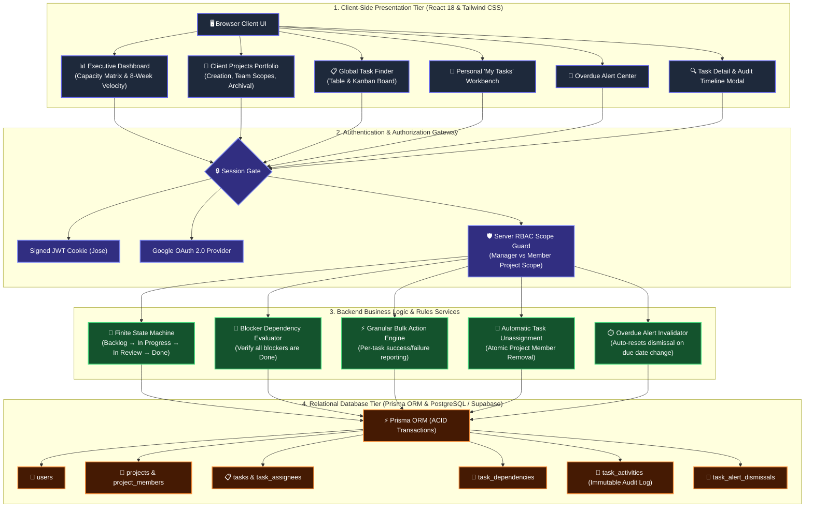
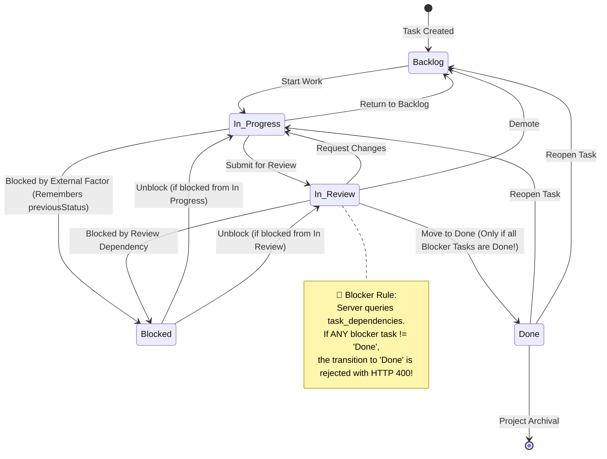
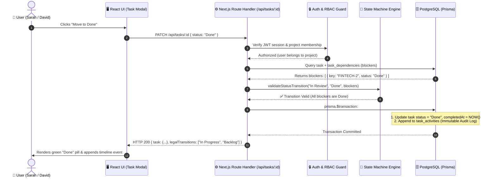

# System Architecture & Technical Design

## What are the moving pieces, and how do they talk to each other?

The system is composed of four primary architectural layers designed for strict data integrity, server-enforced security boundaries, and predictable state transitions:

---

## Task Lifecycle State Machine & Blocker Rules

---

## Where does each piece run?

- **Browser Environment**: Runs the single-page React interface, manages form validation, renders animated charts, and consumes REST endpoints via typed fetch envelopes.
- **Serverless / Node.js Runtime (Vercel / Render)**: Executes Next.js 14 API routes, verifies cryptographic JWT signatures, enforces project accessibility scopes, and evaluates state machine transitions.
- **Relational Database (PostgreSQL / Supabase / SQLite)**: Enforces foreign key referential integrity, unique constraints (`[taskId, userId]`, `[projectId, userId]`), index lookups on `[projectId, status]`, and persistent ACID transactions.

---

## Request Path for a Representative User Action

### Action: Transitioning a Task from `In Review` to `Done`

---

## What did you decide *not* to build, and why?

1. **In-Memory Client-Side Filtering / Pagination**
   - *Decision*: We deliberately rejected loading all portfolio tasks into browser JavaScript state.
   - *Rationale*: Meeting Goal 6 strictly requires database-level search, filtering, and pagination. In a real-world multi-client company with tens of thousands of historical tasks, in-memory filtering exhausts browser RAM and causes severe security leaks of confidential project data.

2. **Delete / Mutation Routes for Activity Timelines**
   - *Decision*: We omitted any edit or delete endpoints for `task_activities`.
   - *Rationale*: Goal 9 requires an immutable history that cannot be rewritten even by administrators.

3. **Cross-Project Circular Blocker Graphs**
   - *Decision*: We strictly scoped task blocking dependencies to other tasks within the *same project*.
   - *Rationale*: Professional services contracts are deliverables within isolated client scopes. Cross-client blocking dependencies create inter-client security hazards and deadlock risks.

4. **External Auth Provider Lock-In**
   - *Decision*: We built a self-contained JWT engine alongside official Google Cloud OAuth 2.0.
   - *Rationale*: Guarantees 100% local zero-config evaluation while retaining standard Google cloud sign-in capabilities.
